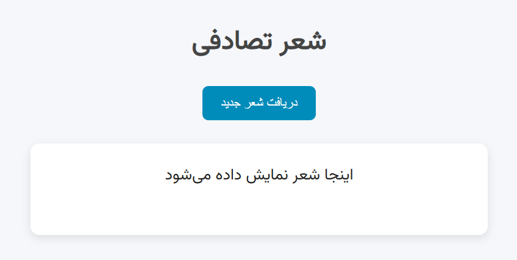

# Ganjoor Random Poem Project

## Description
This project retrieves and displays a random Persian poem from the Ganjoor website using AJAX and the Fetch API. The user can interact with the website by clicking a button to fetch a new random poem each time.

## Features

- **Random Poem Fetching**: Get a random Persian poem from Ganjoor with a button click.
- **Dynamic Display**: Poems are dynamically displayed on the webpage.
- **Responsive Design**: The page is designed to be responsive and accessible on various screen sizes.
- **AJAX Request**: Utilizes AJAX to fetch data asynchronously without reloading the page.

## Technologies Used

- **HTML5**: Structure and layout of the web page.
- **CSS3**: Styling of the web page to create an aesthetic and user-friendly experience.
- **JavaScript (AJAX)**: Used to fetch and display the random poem asynchronously.
- **Fetch API**: To make asynchronous HTTP requests to retrieve data from the Ganjoor website.

## How to Use

1. **Clone the repository**:
   ```bash
   https://github.com/kasrakhalooei/RandomVerse.git
   ```

2. **Open `index.html`** in a web browser.

3. **Click the "دریافت شعر جدید" button** to fetch a new random poem.

## Setup Instructions

To run this project locally:

1. Clone the repository to your local machine.
   ```bash
   git clone https://github.com/your-username/ganjoor-random-poem.git
   ```

2. Open the `index.html` file in any browser to see the app in action.

3. Optionally, host the project on your server to make it accessible to others.

## Screenshots



## Contribution

If you'd like to contribute to this project, feel free to fork the repository, make your changes, and submit a pull request. Contributions are always welcome!

## License

This project is licensed under the MIT License - see the [LICENSE](LICENSE) file for details.

## Acknowledgments

- **Ganjoor** for providing the poetry content.
- **AJAX** and **Fetch API** for simplifying data retrieval without page reloads.
- Inspiration from Persian literature and web development communities.
